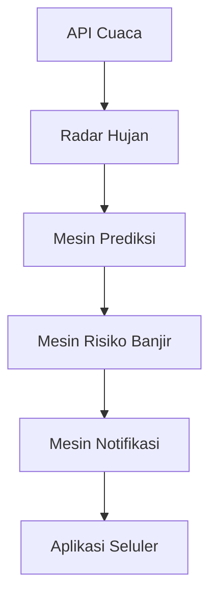

# Gambaran Proyek: PRAKIRA

## Visi
Memberikan setiap keluarga waktu yang cukup untuk melindungi rumah dan kendaraan mereka sebelum banjir melanda.

## Misi
Membangun platform prediksi banjir yang akurat, dapat dijelaskan (explainable), dan mudah digunakan dengan menggabungkan:
- Radar cuaca
- Intensitas curah hujan
- Pergerakan angin
- Kondisi sungai
- Analisis daerah aliran sungai (DAS)
- Elevasi dataran (kontur tanah)
- Data historis kejadian banjir
- Kecerdasan Buatan (Artificial Intelligence)

## Pernyataan Masalah
Warga sering kali menerima informasi banjir ketika sudah terlambat. Sebagian besar aplikasi cuaca hanya menjawab: *"Apakah akan turun hujan?"* Padahal yang sebenarnya perlu diketahui masyarakat adalah: *"Apakah rumah saya akan kebanjiran?"* PRAKIRA fokus untuk menjawab pertanyaan ini.

## Tujuan Proyek
- Memprediksi risiko banjir sebelum banjir terjadi.
- Memperkirakan waktu kedatangan banjir secara akurat.
- Memperkirakan potensi kedalaman genangan banjir.
- Mengirimkan pemberitahuan peringatan dini.
- Menjelaskan alasan mengapa banjir diprediksi terjadi.
- Membantu warga melindungi rumah dan kendaraan mereka.
- Menerbitkan aplikasi seluler ke Google Play Store agar mudah diakses publik.

## Pengguna Sasaran Awal
- Pemilik rumah
- Keluarga
- Pemilik kendaraan
- Tokoh masyarakat (RT/RW)
- Relawan bencana

## Lokasi Target (Fase 1)
- Pondok Kacang Prima
- Pondok Aren
- Tangerang Selatan

## Tumpukan Teknologi (Technology Stack)

- **Aplikasi Seluler:** Flutter (Target awal untuk Android / Google Play Store)
- **Backend (Server):** FastAPI (Python)
- **Database:** PostgreSQL, PostGIS, Redis
- **AI (Kecerdasan Buatan):** Python, Machine Learning, Rule Engine
- **Peta:** OpenStreetMap
- **Data Cuaca:** BMKG, OpenWeather, Penyedia Radar Hujan

## Arsitektur

## Prinsip Proyek
Setiap fitur harus menjawab satu pertanyaan: **"Apakah ini membantu pengguna bersiap sebelum banjir?"** Jika jawabannya tidak, fitur tersebut tidak boleh dibangun.
