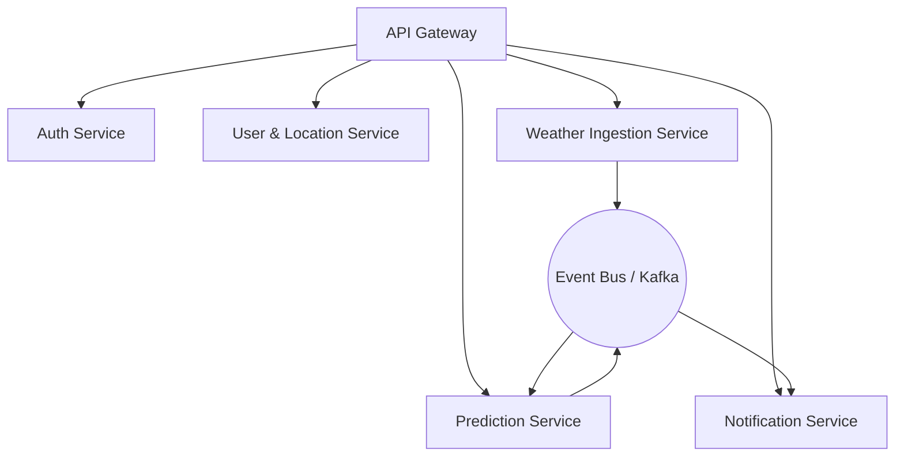

# Arsitektur Sistem (System Architecture)

Dokumen ini menjelaskan arsitektur teknis menyeluruh dari platform **PRAKIRA**, termasuk komponen sistem, aliran data, lapisan layanan, dan infrastruktur penerapan.

---

## 1. Gambaran Umum Sistem (System Overview)
Sistem PRAKIRA dirancang sebagai platform terdistribusi untuk peringatan dini banjir waktu-nyata (*real-time*). Sistem secara konstan menarik (ingest) data meteorologi, hidrologi, dan topografi dari sumber eksternal (API BMKG, OpenWeather). Data tersebut kemudian diproses menggunakan Mesin Prediksi (Prediction Engine) berbasis AI dan Rule-based Engine untuk menentukan tingkat risiko banjir per koordinat lokasi pengguna. Jika terdeteksi risiko tinggi, sistem akan secara otomatis mengirimkan peringatan ke perangkat seluler pengguna.

## 2. Arsitektur Tingkat Tinggi (High Level Architecture)

```mermaid
graph LR
    A[Aplikasi Seluler\n(Flutter)] <--> B[API Gateway\n(Load Balancer)]
    B <--> C[Layanan Backend\n(FastAPI)]
    
    C --> D[(Database Utama\nPostgreSQL + PostGIS)]
    C --> E[(Cache\nRedis)]
    
    F[Data Pihak Ketiga\n(BMKG, Radar)] --> G[Pekerja Latar Belakang\n(Celery / Cron)]
    G --> C
    
    C --> H[Mesin Prediksi AI]
    
    C --> I[Layanan Notifikasi\n(FCM)]
    I --> A
```

## 3. Diagram Layanan Mikro (Microservice Diagram)
Untuk menjaga skalabilitas, backend dirancang dengan pola layanan mikro modular:



- **Auth Service:** Menangani login, pendaftaran, dan pengelolaan token (JWT/OAuth).
- **User Service:** Mengelola profil pengguna dan data koordinat lokasi rumah yang dilacak.
- **Weather Ingestion Service:** Bertugas mengambil dan membersihkan data dari API pihak ketiga.
- **Prediction Service:** Menjalankan inferensi model AI terhadap data yang dikumpulkan.
- **Notification Service:** Mengelola antrean pengiriman notifikasi massal secara asinkron.

## 4. Aliran Data (Data Flow)
1. **Pengumpulan Data:** Pekerja (*workers*) yang dijadwalkan secara periodik (setiap X menit) mengambil data curah hujan, level air sungai, dan arah angin dari penyedia eksternal.
2. **Pemrosesan Spasial:** Data baru disimpan ke database, lalu dicocokkan (cross-matched) dengan data spasial lokasi rumah pengguna (disimpan menggunakan PostGIS).
3. **Analisis Risiko:** Mesin Prediksi menerima snapshot data terbaru. Model mengevaluasi *threshold* banjir untuk setiap zona/lokasi (berdasarkan curah hujan historis + daya serap tanah + topografi).
4. **Pemicu (Trigger):** Jika probabilitas banjir melewati 85% dan waktu estimasi tiba kurang dari 3 jam, status lokasi pengguna diperbarui menjadi "BAHAYA".
5. **Peringatan:** Pembaruan status memicu *event* ke Notification Service, yang kemudian mendorong peringatan instan (FCM) ke ponsel pengguna terkait.

## 5. Lapisan API (API Layer)
- **Protokol:** RESTful API untuk klien seluler.
- **Keamanan:** Dilindungi oleh HTTPS (TLS 1.3), dengan mekanisme perlindungan serangan DDoS (contoh: Cloudflare).
- **Pembatasan Laju (Rate Limiting):** Diterapkan melalui Redis pada API Gateway untuk mencegah spam (misalnya maksimal 60 permintaan/menit per pengguna).
- **Dokumentasi API:** Disediakan secara otomatis menggunakan Swagger/OpenAPI bawaan dari FastAPI (dapat diakses di `/docs`).

## 6. Autentikasi (Authentication)
- Menggunakan **Firebase Authentication** atau sistem berbasis **JSON Web Tokens (JWT)**.
- Opsi masuk (*Login*) mencakup Login Google (OAuth2) dan pendaftaran menggunakan Email/Kata Sandi.
- *Refresh token* akan dirotasi dengan kedaluwarsa singkat (misalnya 15 menit untuk *access token*, 7 hari untuk *refresh token*).

## 7. Notifikasi (Notification)
- Menggunakan **Firebase Cloud Messaging (FCM)** untuk pengiriman *push notification* yang andal ke perangkat Android (dan berpotensi iOS).
- Layanan notifikasi bersifat asinkron untuk memastikan server API utama tidak terhambat (*blocking*) saat mengirim pesan ke puluhan ribu pengguna sekaligus.
- Pesan peringatan dilengkapi dengan format kaya (*rich format*), dengan penanda bahaya merah dan tautan langsung ("Buka Radar").

## 8. Mesin Prediksi (Prediction Engine)
Terdiri dari dua lapisan untuk memastikan keandalan (fallback):
1. **Model Pembelajaran Mesin (AI):** Dilatih menggunakan data historis iklim dan catatan banjir lokal. (Misal: Regresi Spasial atau jaringan XGBoost/LSTM untuk mendeteksi anomali deret waktu).
2. **Rule-Based Fallback (Mesin Aturan Bawaan):** Jika AI gagal mengembalikan hasil dengan cepat, sistem mundur ke aturan tetap dasar (contoh: *Jika hujan > 50mm/jam DAN pompa mati = Risiko Tinggi*).
- Komponen penjelasan (*Explainability*) dirancang untuk menerjemahkan nilai pembobotan prediksi menjadi teks yang mudah dibaca pengguna ("Banjir diprediksi karena sungai Angke meluap").

## 9. Penerapan (Deployment)
- **Kontainerisasi:** Semua layanan di-_package_ menggunakan Docker.
- **Orkestrasi:** Dikelola menggunakan Kubernetes (K8s) atau Google Cloud Run untuk memungkinkan *auto-scaling* (penskalaan otomatis) selama puncak aktivitas badai ekstrem.
- **CI/CD:** Pipeline diotomatisasi melalui GitHub Actions. Setiap dorongan kode (push) ke cabang *main* akan memicu pengujian (testing), pembangunan Docker image (build), dan penerapan bergulir (rolling deployment).

## 10. Tumpukan Teknologi (Technology Stack)
- **Frontend (Klien Seluler):** Flutter, Dart.
- **Backend (API):** Python 3, FastAPI, Celery (untuk antrean tugas latar belakang).
- **Infrastruktur Basis Data:** PostgreSQL (dengan ekstensi PostGIS untuk query spasial latensi rendah), Redis (untuk caching dan *message broker*).
- **Cloud & DevOps:** Google Cloud Platform (GCP) atau Amazon Web Services (AWS), Docker, GitHub Actions.
- **AI/ML:** Scikit-Learn, TensorFlow/PyTorch, Pandas (untuk rekayasa fitur data).
