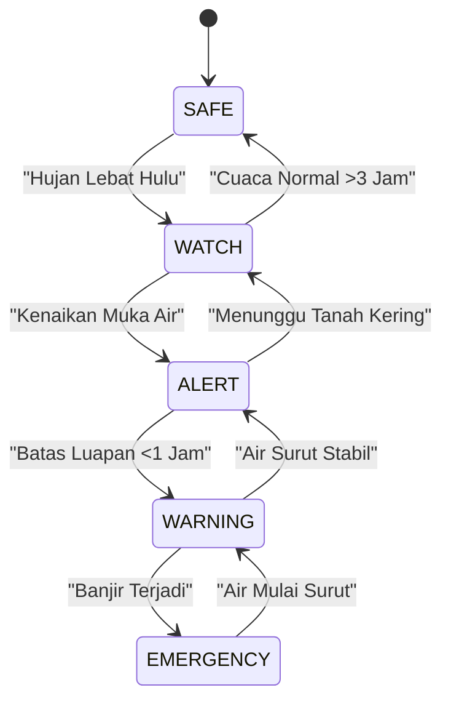
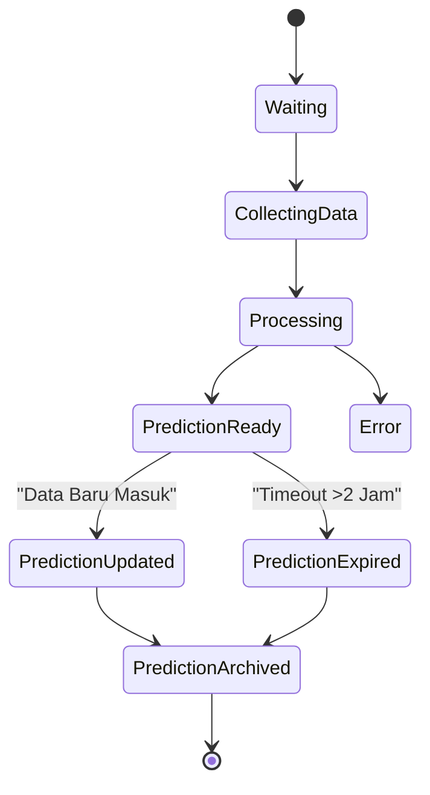
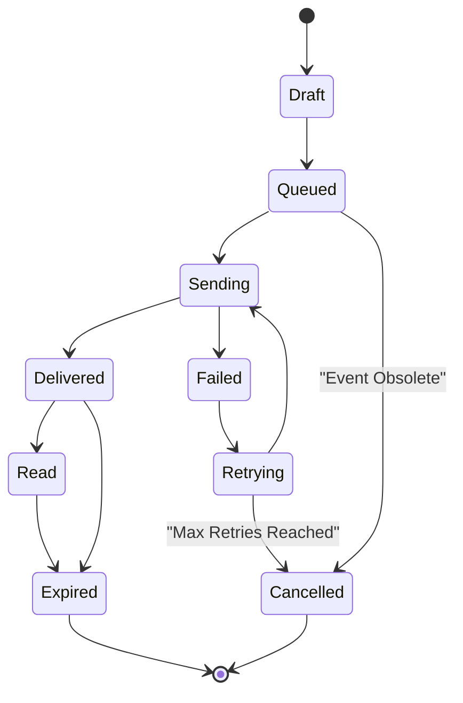
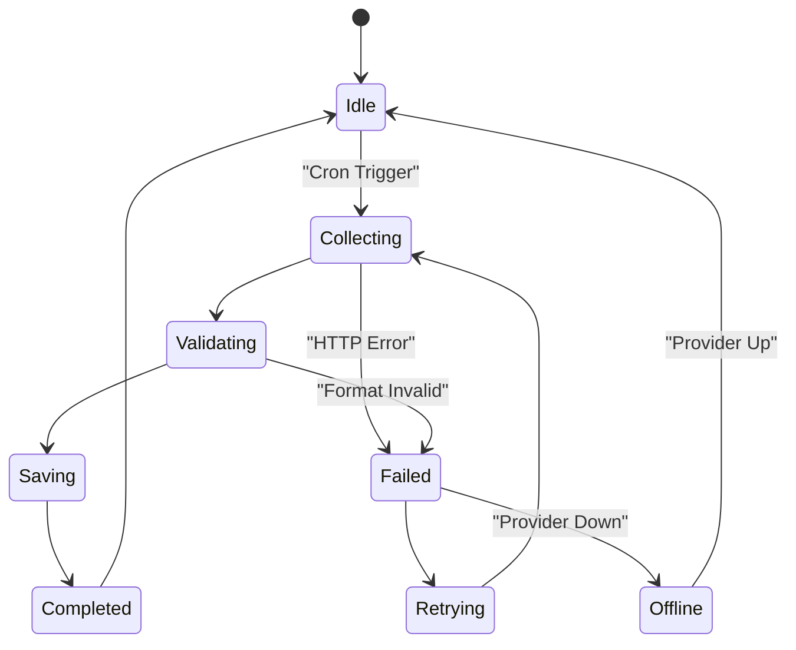
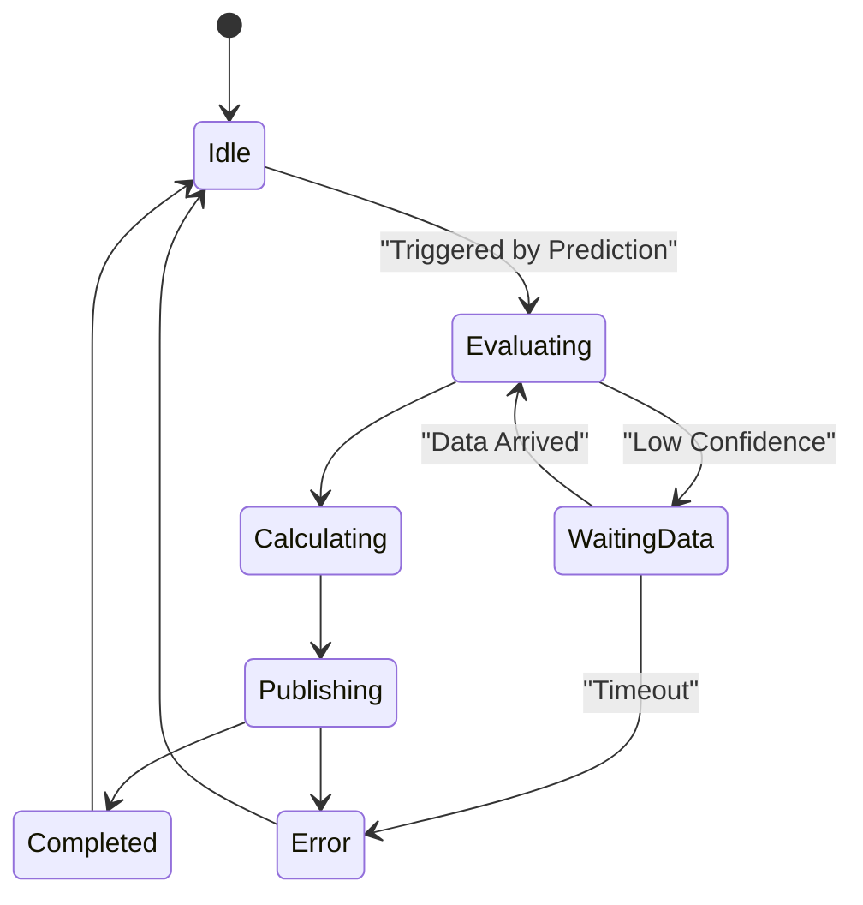

# Mesin Status Sistem (STATE_MACHINE)

Versi: 1.0  
Proyek: PRAKIRA  
Status: Spesifikasi Sistem  
Pemilik: Lead Systems Engineer  

---

## 1. Tujuan (Purpose)

Dokumen ini mendefinisikan setiap transisi status (*state transition*) yang digunakan di seluruh platform PRAKIRA.

PRAKIRA menggunakan *Finite State Machines* (FSM) karena:
* Menjamin bahwa sistem bertindak secara **deterministik** (dapat diprediksi).
* Menghindari kondisi di mana sistem "terjebak" (*stuck*) atau memunculkan status tak terduga (*undefined states*).
* Memastikan bahwa setiap perubahan risiko, pengumpulan data, dan notifikasi dapat dilacak dan dijelaskan (*explainable*).
* Sangat cocok untuk sistem skala *enterprise* yang digerakkan oleh peristiwa asinkron (*event-driven*).

---

## 2. Gambaran Mesin Status (State Machine Overview)

Mesin status yang saling terhubung membentuk siklus hidup intelijen banjir:

**Observasi Lingkungan** (Sensor/API mengambil data)  
↓  
**Prediksi** (Mesin Hidrologi mengkalkulasi)  
↓  
**Risiko** (Mesin Keputusan menetapkan status bahaya)  
↓  
**Notifikasi** (Pengguna diberi peringatan)  
↓  
**Pemulihan** (Air surut, sistem kembali ke normal)

---

## 3. Status Risiko Banjir (Flood Risk States)

Status ini merepresentasikan kondisi lingkungan aktual yang dilihat oleh pengguna.

* **SAFE (Aman):**
  * *Arti:* Tidak ada ancaman banjir.
  * *Kondisi:* Cuaca cerah, sungai normal.
  * *Pengalaman Pengguna:* Dasbor menunjukkan hijau.

* **WATCH (Waspada):**
  * *Arti:* Ada potensi awal pembentukan ancaman.
  * *Kondisi:* Hujan lebat di hulu, cuaca mendung pekat di lokal.
  * *Pengalaman Pengguna:* Dasbor kuning, pengguna diminta siaga.

* **ALERT (Siaga):**
  * *Arti:* Ancaman banjir kemungkinan besar akan terjadi.
  * *Kondisi:* Muka air sungai naik di atas normal, ETA terdeteksi.
  * *Pengalaman Pengguna:* Peringatan awal dikirim ke ponsel.

* **WARNING (Bahaya):**
  * *Arti:* Banjir segera melanda atau sudah mulai merendam akses jalan.
  * *Kondisi:* Limpasan sungai mulai terjadi, curah hujan ekstrem bertahan.
  * *Pengalaman Pengguna:* Instruksi untuk segera memindahkan kendaraan.

* **EMERGENCY (Darurat):**
  * *Arti:* Banjir parah sedang berlangsung.
  * *Kondisi:* Ketinggian air melampaui batas kritis (>50cm), tanggul mungkin jebol.
  * *Pengalaman Pengguna:* Rekomendasi evakuasi.

---

## 4. Aturan Transisi (Transition Rules)

Transisi hanya terjadi jika kondisi hidrologi terpenuhi:

* **SAFE → WATCH:** Dipicu oleh deteksi awal hujan lebat di DAS.
* **WATCH → ALERT:** Dipicu jika tren kenaikan sungai konsisten selama >15 menit.
* **ALERT → WARNING:** Dipicu jika prediksi menunjukkan air akan meluap dalam waktu kurang dari 60 menit (ETA).
* **WARNING → EMERGENCY:** Dipicu oleh konfirmasi sensor muka air jalan tinggi, atau laporan valid warga bahwa air masuk rumah.
* **EMERGENCY → WARNING:** Air mulai surut (debit menurun).
* **WARNING → ALERT:** Penurunan muka air yang stabil.
* **ALERT → WATCH:** Tidak ada hujan tambahan, namun tanah masih jenuh.
* **WATCH → SAFE:** Kondisi sepenuhnya normal selama 3 jam.

---

## 5. Mesin Status Prediksi (Prediction State Machine)

Siklus hidup satu blok prediksi:

* **Waiting:** Menunggu jeda waktu (misal tiap 5 menit).
* **Collecting Data:** Menerima *snapshot* data dari Event Bus.
* **Processing:** Menghitung fitur hidrologi.
* **Prediction Ready:** Skor dan ETA berhasil dihitung.
* **Prediction Updated:** Prediksi direvisi oleh data cuaca terbaru.
* **Prediction Expired:** Melewati masa berlaku (misal >1 jam tanpa pembaruan).
* **Prediction Archived:** Disimpan secara historis.

*Transisi Utama:* Waiting → Collecting Data → Processing → Prediction Ready → Prediction Archived.

---

## 6. Mesin Status Notifikasi (Notification State Machine)

Siklus hidup pengiriman pesan ke ponsel:

* **Draft:** Diformat berdasarkan status risiko.
* **Queued:** Masuk antrean pengiriman.
* **Sending:** Berada di *pipeline* Firebase Cloud Messaging (FCM).
* **Delivered:** Terkirim ke perangkat pengguna.
* **Read:** Pengguna membuka notifikasi.
* **Expired:** Pesan kedaluwarsa (misal peringatan basi).
* **Failed:** Jaringan gagal.
* **Retrying:** Pengulangan percobaan.
* **Cancelled:** Dibatalkan karena sistem kembali SAFE sebelum terkirim.

---

## 7. Mesin Status Laporan Masyarakat (Community Report State Machine)

* **Draft:** Pengguna mulai mengetik laporan.
* **Submitted:** Dikirim ke server.
* **Pending Review:** Menunggu filter AI/Moderator.
* **Verified:** Disetujui, digunakan untuk memvalidasi model.
* **Rejected:** Spam atau tidak valid.
* **Archived:** Peristiwa banjir telah usai.

---

## 8. Mesin Status Pengumpul Data (Data Collector State Machine)

* **Idle:** Menunggu *cron/trigger*.
* **Collecting:** Sedang menghubungi API BMKG/Satelit.
* **Validating:** Mengecek keutuhan JSON.
* **Saving:** Menerbitkan ke Event Bus.
* **Completed:** Sukses.
* **Retrying:** Mengulang (backoff).
* **Failed:** Melebihi batas toleransi percobaan.
* **Offline:** API hulu mati atau perbaikan jaringan.

---

## 9. Mesin Status Sensor - Masa Depan (Sensor State Machine)

* **Online:** Mengirim data stabil.
* **Offline:** Tidak ada *heartbeat* >10 menit.
* **Delayed:** Ping normal namun timestamp data lawas.
* **Maintenance:** Perawatan peranti keras.
* **Unknown:** Belum diregistrasi penuh.

---

## 10. Mesin Status Mesin Keputusan (Decision Engine State Machine)

* **Idle:** Menunggu *event* Prediksi.
* **Evaluating:** Membaca *rules engine*.
* **Calculating:** Menghitung skor final.
* **Waiting Data:** Menahan diri jika *Confidence Score* rendah.
* **Publishing:** Menyiarkan risiko ke bus.
* **Completed:** Siklus selesai.
* **Error:** Logika gagal.

---

## 11. Mesin Status Pemulihan (Recovery State Machine)

Pemulihan mundur (*downgrade*) harus dilakukan secara perlahan untuk mencegah "alarm berkedip" (*flapping alerts*).
Sistem tidak boleh melompat dari `EMERGENCY` langsung ke `SAFE`.
Transisi harus: `EMERGENCY` → `WARNING` → `ALERT` → `WATCH` → `SAFE`, dengan setiap fase wajib tertahan minimal 30 menit (disebut kondisi *Debouncing*).

---

## 12. Aturan Batas Waktu (Timeout Rules)

* **Processing State:** Maksimum 5 detik. Jika lebih, berpindah ke *Error*.
* **Sending State (Notifikasi):** Maksimum 30 detik sebelum masuk ke *Retrying*.
* **Prediction Ready:** Otomatis menjadi *Expired* jika berusia >2 jam tanpa pembaruan.
* **Queued:** Dibatalkan jika >15 menit (tidak relevan lagi).

---

## 13. Status Kesalahan (Error States)

* **Temporary Failure:** Jaringan sesaat mati (mengaktifkan *Retry*).
* **Permanent Failure:** Kredensial API salah atau blokir IP (menghentikan *Collector* dan admin diinfokan).
* **Data Missing:** Kolom cuaca penting kosong (Memicu *Partial Prediction* dengan Confidence turun 30%).
* **API Failure:** Henti memproses *event* dan kirim notifikasi ke dasbor *engineering*.

---

## 14. Diagram Transisi Status (State Transition Diagrams)

### Diagram Risiko Banjir (Flood Risk)

### Diagram Prediksi (Prediction)

### Diagram Notifikasi (Notification)

### Diagram Pengumpul Data (Collector)

### Diagram Mesin Keputusan (Decision Engine)

---

## 15. Kebutuhan Pencatatan (Logging Requirements)

Setiap transisi status **wajib** dicatat (*logged*). Log harus memuat:
* `Timestamp`
* `Entity ID` (contoh: Area-001, Msg-991)
* `From State`
* `To State`
* `Trigger / Reason` (Kondisi yang memicu)
* `Correlation ID`

---

## 16. Kebutuhan Audit (Audit Requirements)

Untuk menjamin *explainability*, semua transisi dari Mesin Keputusan dan Status Risiko Banjir harus ditambahkan (*append-only*) ke dalam basis data **Audit Trail**. 
Sistem tidak pernah menghapus atau mengubah catatan ini. Hal ini penting untuk diulas setelah bencana banjir (pasca-insiden) guna memperbaiki ambang batas model (*model calibration*).

---

## 17. Ekspansi Masa Depan (Future Expansion)

Pendekatan Mesin Status Terhingga (*Finite State Machine*) memungkinkan penambahan status baru di masa mendatang tanpa memecahkan kode yang ada (kompatibilitas mundur). 
Sebagai contoh, jika pada Versi 3 ditambahkan fitur "Evakuasi", kita hanya perlu menambahkan *state* `EVACUATION` di atas `EMERGENCY`, dan mendaftarkan *transition rules* barunya di tingkat Mesin Keputusan.
